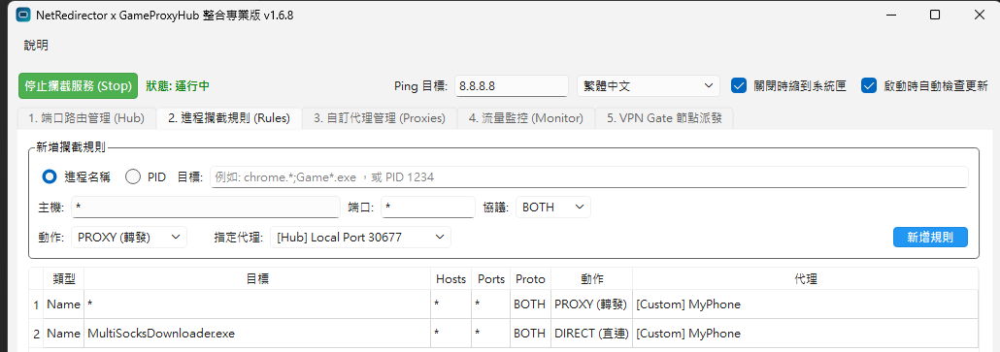
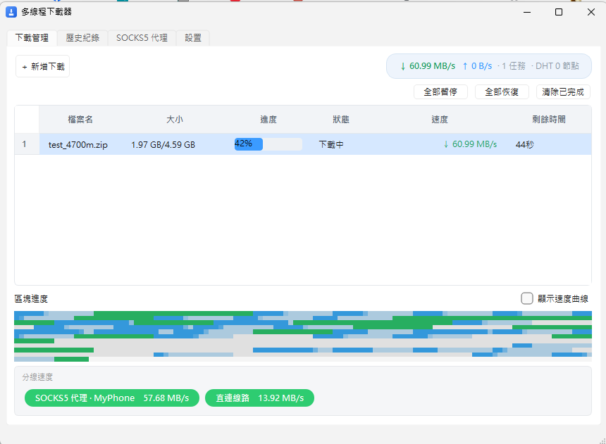

# MultiSocksDownloader 多代理下載器

使用多個 SOCKS5 代理、多線程並行下載，支援斷點續傳的桌面下載工具。

> ## ⚠️ 搭配 NetRedirector（PPPoE 本地網路）必讀
>
> 若你使用 [**NetRedirector**](https://github.com/tokyoxpa3/NetRedirector) 做流量轉送、並以 **PPPoE 本地網路**運作，
> **務必把 `MultiSocksDownloader.exe` 加入 NetRedirector 的直連清單（Direct / Bypass）**。
>
> 否則本程式通往 SOCKS5 代理的連線會被 NetRedirector 再次轉送，
> 導致**多代理聚合失效、速度變慢，甚至完全無法連線**。



> ## ⚠️ 搭配 5G-Proxy-Pro（手機 5G SOCKS5）注意事項
>
> 使用 [5G-Proxy-Pro](https://github.com/tokyoxpa3/5G-Proxy-Pro) 這類「手機 5G 架 SOCKS5」的線路時，
> **同一條線路不要同時開太多 BT 任務**。
> 5G-Proxy-Pro 的 SOCKS5 握手是阻塞式、握手執行緒池已擴充至 192 條、握手逾時縮短為 3 秒，
> Happy Eyeballs 連線逾時也由 5 秒縮短為 2 秒（加快容錯切換）。
> 每個 BT 任務在代理線路最多開 30 條連線；即便握手池已放大，
> 單線同時開太多 BT 任務仍會互相搶握手執行緒、拖慢甚至丟連線。
>
> 程式預設「每線同時 BT 任務上限 = 5」（設定 → 每線同時 BT 任務上限，可調整，0 = 不提醒）。
> 超過上限仍會繼續新增，但會跳出提醒。

## 為什麼 5G 行動網路也能下載 BT？

一般 5G 行動網路想下載 BT / 磁力其實非常困難，主因有二：

- **電信級 NAT（CGNAT）**：手機沒有公網 IPv4，外部 peer 無法主動連進來，只能靠「主動向外連線」找 peer。
- **UDP / DHT 被封**：5G 與 SOCKS5 轉接環境下，DHT、UDP tracker、uTP 這些 BT 找 peer 的主要管道常被封或不轉發。

本程式用以下方法繞過這些限制，讓 5G 也能跑 BT：

- **SOCKS5 主動對外連線**：BT 流量經 SOCKS5 代理（如 5G-Proxy-Pro 的手機 5G）主動連向 peer，繞開 CGNAT「無法被連入」的困境。
- **僅用 TCP**：SOCKS5 不轉發 UDP，代理線路強制走 TCP、停用 uTP/UDP，避免無效連線浪費資源。
- **HTTP tracker 後備**：DHT/UDP tracker 被封時，改走 TCP 的 HTTP/HTTPS tracker 取得 metadata 與 peer。
- **偽裝 qBittorrent 4.6.0**：避免自製客戶端被 tracker 白名單拒收。
- **多線路聚合**：單一檔案切成不重疊分段，同時經多條直連/SOCKS5 線路分段下載。

也正因如此，本程式**必須自己掌控這些 SOCKS5 連線**。若搭配 NetRedirector 做流量轉送，務必把 `MultiSocksDownloader.exe` 加入直連清單——否則它通往各代理的連線會被 NetRedirector 再轉一次，上面這整套「繞過 5G 限制」的機制就會失效（見開頭提醒）。

## 功能特點

- **多代理並行下載**：單一檔案可同時透過多個 SOCKS5 代理分段下載，提升速度與穩定性。
- **多線程分片**：檔案切成多個區塊（bitmap 追蹤），每個代理以多條線程同時抓取不同區塊。
- **斷點續傳**：進度以 `.progress` 檔持久化，關閉程式後重啟可自動恢復未完成的任務。
- **BT 下載（magnet/.torrent）**：支援磁力連結與 `.torrent` 檔，以 libtorrent 為引擎；公開種子支援多線路聚合下載（多個 session 各綁定直連或 SOCKS5 代理、分片下載），private（PT）種子與選擇性下載（僅勾選部分檔案）維持單線路。
- **串流解析下載（YouTube 等影音網站）**：貼上網址會自動偵測是否為影片/音訊頁面，偵測到就自動用 yt-dlp 解析成單檔直連 URL，交給現有的多代理分段引擎續傳；DASH/HLS 分段串流改走 yt-dlp 原生下載，並以內建 ffmpeg 合併視訊+音訊為 MP4，且自動帶出畫質（最高 4K）與 FPS 上限可選。DRM 加密串流會自動略過，不會試圖破解。解析時一併走 SOCKS5 代理（`socks5h`＝遠端 DNS），可繞過本機 DNS 對影音站台的封鎖/汙染。
- **來源／集數選擇**：針對「一劇一網址、切換來源/集數不改網址」的站台，解析後在對話框多出「來源 / 集數」下拉，檔名自動帶上 `[s<來源>e<集>]` 標籤，避免多集互相覆蓋（需對應站台的 yt-dlp 外掛，外掛檔本身不進版控）。
- **下載穩定度防護**：HTTP 分段引擎新增線路健康度管理——同一線路連續失敗達門檻會暫時隔離（60 秒），慢速滴流的卡死線路會被停滯看門狗主動中斷並交由其他線路接手，全任務連續無進度達上限即判定失敗可重試；單線模式（伺服器不支援 Range）失敗會指數退避自動重試，不再把半成品誤標為完成。
- **開機自動啟動**：設定頁可勾選「開機時自動啟動」，登錄到目前使用者的啟動項目（HKCU，無需管理員權限），停用時只移除本程式寫入的值。
- **Chrome 擴充功能**：攔截瀏覽器下載事件，自動把連結送進本程式（見 `chrome_extension/`）。
- **區塊進度視覺**：磁碟叢集風格的區塊圖，即時顯示各分段下載狀態。

## 畫面



## 架構

- `downloader.py` — 下載核心（`DownloadTask`、`DownloadManager`）
- `stream_resolver.py` — 串流解析（可注入的 `StreamResolver` 介面 + `YtDlpStreamResolver` 實作，回傳結構化失敗原因）
- `bt_downloader.py` — BT 下載（libtorrent，多 session 多線路聚合）
- `ftp_downloader.py` — FTP 下載（SOCKS5 控制/資料通道）
- `ui.py` — PySide6 圖形介面
- `startup.py` — Windows 開機自動啟動（HKCU Run 機碼）
- `http_server.py` — 接收 Chrome 擴充功能請求的本機 HTTP 伺服器
- `logging_setup.py` — 全專案唯一的 logging 設定入口（`setup_logging(debug)`）
- `fetch_ffmpeg.py` — 建置/發佈時下載 LGPL 版 ffmpeg 並打包（供串流視訊+音訊合併使用）
- `MultiSocksDownloader.py` — 程式入口
- `repro.py` — 無 GUI 的 headless 複現工具（`add_task → start_task` 全鏈路）
- `yt_dlp_plugins/` — 自訂 yt-dlp 外掛（extractor）放置目錄（本機開發用，整個目錄不進版控）；本機建置時若存在，會隨主程式打包、放在 exe 旁自動載入
- `tools/extractor_maker/` — 開發工具：給定陌生網站 URL，用 Playwright 攔截請求 → LLM 生成 yt-dlp extractor/resolver
- `chrome_extension/` — Chrome 擴充功能（Manifest V3）

## 安裝

```bash
pip install -r requirements.txt
```

建置套件（用 Nuitka 編譯成獨立執行檔）另裝：

```bash
pip install -r requirements-dev.txt
```

## 執行

```bash
# 一般執行
python MultiSocksDownloader.py

# 開啟 verbose 診斷輸出（DEBUG 層級），所有內部事件/錯誤都會印到終端
python MultiSocksDownloader.py --debug
```

> **跑原始碼 vs 跑 exe 的差別**：`python MultiSocksDownloader.py` 直接跑原始碼，
> 上面這些 log（尤其是 `--debug`）會印在啟動它的終端機視窗，改任何 `.py` 後
> 重新執行即生效；`MultiSocksDownloader.dist/MultiSocksDownloader.exe` 是
> Nuitka 打包的獨立執行檔，已把當時的程式碼編譯凍結進去，**改 `.py` 不會影響
> 已打包的 exe**，且 exe 以 `--windows-console-mode=disable` 編譯、預設無主控台，
> log 不會印到螢幕。要除錯請一律跑原始碼（`python MultiSocksDownloader.py --debug`），
> 確認問題後再重新跑 `build.bat` 打包出新的 exe。

## 測試

```bash
python -m unittest discover -s tests -v
```

## 偵錯與複現（headless）

不用啟動整包 GUI，就能在終端跑通「新增任務 → 啟動下載」全鏈路並印出每個階段的狀態與錯誤：

```bash
# 離線複現「解析失敗」：注入假解析器，不需要真實網路，直接看 error/reason
python repro.py https://youtube.com/watch?v=badid --resolve --fake-resolve-fail

# 真實解析一個不存在的 YouTube 影片，看 yt-dlp 的結構化失敗原因
python repro.py "https://www.youtube.com/watch?v=AAAAAAAAAAA" --resolve --debug
```

`repro.py` 會以隔離的暫時設定檔與儲存目錄執行，不污染真實的
`~/.multi_socks_downloader/config.json`；當 `resolve_stream=True` 而解析失敗時，
任務會以 `error` 中止、`error_reason` 明確標示原因，**不會**把網頁 HTML 存成檔案。

> 所有失敗路徑都透過結構化 log 記錄（`event=... task_id=... url=... reason=...`），
> 任何 LLM 或工程師都能在 5 分鐘內沿著 `add_task → start_task → prepare → resolve → probe`
> 這條鏈定位死因。verbose 輸出統一由 `--debug` 開關，不會有散落的臨時 print 殘留。

## 建置（獨立執行檔）

```bash
build.bat
```

編譯完成後會在專案根目錄產出 `MultiSocksDownloader.dist/` 資料夾，內含可直接執行的 `MultiSocksDownloader.exe`，無需安裝 Python。

> 編譯需要 Windows 上的 C 編譯器：Microsoft Visual Studio（MSVC）或 MinGW64。對應的 Nuitka 指令如下：

```bash
nuitka --standalone --windows-console-mode=disable --enable-plugin=pyside6 MultiSocksDownloader.py
```

## 設定檔

程式設定儲存於 `%USERPROFILE%\.multi_socks_downloader\config.json`，主要欄位：

- `save_dir`：預設下載目錄
- `socks_proxies`：已設定的 SOCKS5 代理（可在圖形介面中新增）
- `speed_limit`：全局限速（bytes/sec，0 為不限速）
- `custom_headers`：自訂請求標頭
- `history`：歷史下載紀錄

## HTTP API

本機 HTTP 伺服器預設監聽 `127.0.0.1:8765`，供 Chrome 擴充功能呼叫：

| 方法 | 路徑 | 說明 |
|------|------|------|
| `GET` | `/ping` | 連線檢查，回傳 `{"status":"ok"}` |
| `GET` | `/tasks` | 查詢所有任務的下載進度 |
| `POST` | `/` | 新增下載任務 |

`POST /` 的 JSON 主體範例：

```json
{
  "url": "https://example.com/file.zip",
  "filename": "file.zip",
  "chunks_per_part": 0,
  "threads_per_proxy": 6,
  "headers": {}
}
```

- `chunks_per_part` 設為 `0` 表示依檔案大小自適應分片。
- `threads_per_proxy` 為每個代理的下載線程數，預設 `6`。

## Chrome 擴充功能

安裝與使用方式請見 [`chrome_extension/README.md`](chrome_extension/README.md)。

> **打包與自動更新**：`chrome_extension/`、`install_extension.bat`、`open_extensions.ps1`
> 會隨主程式一起打包進發佈 zip，並放在 `MultiSocksDownloader.exe` 旁邊，
> 與主程式綁定、隨自動更新一起換新。擴充套件直接從該資料夾載入，無需另外複製。
> Chrome 不會自動重載「未封裝」擴充套件，更新後請在 `chrome://extensions/`
> 點該擴充套件的 ↻ 重載，或重啟 Chrome，才會套用新版。
